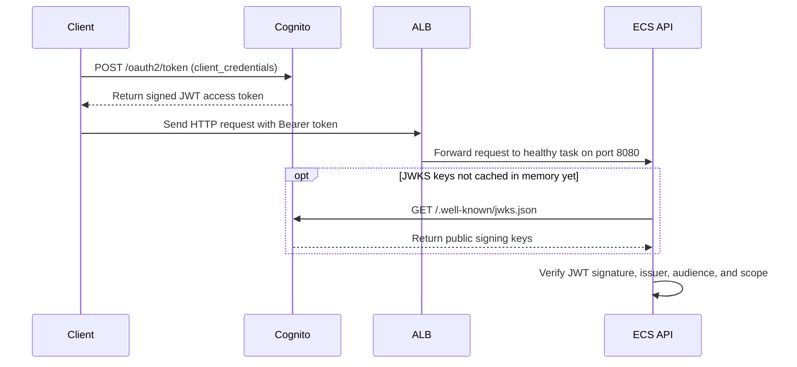
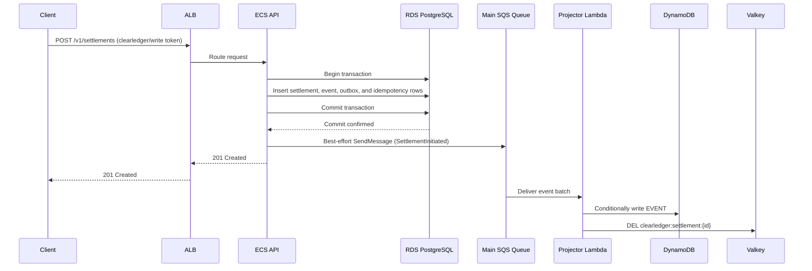
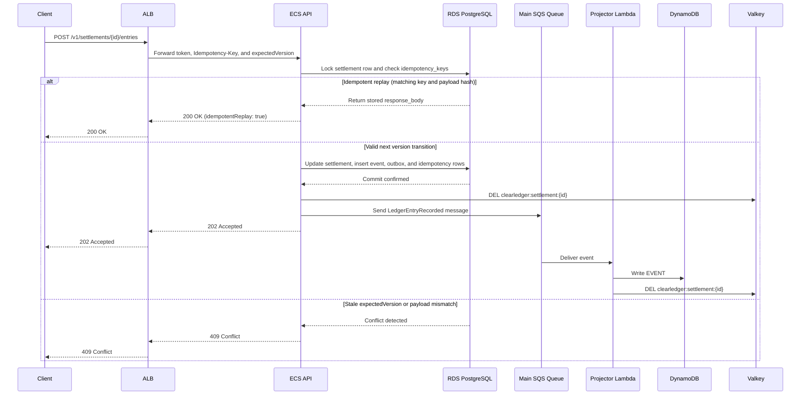
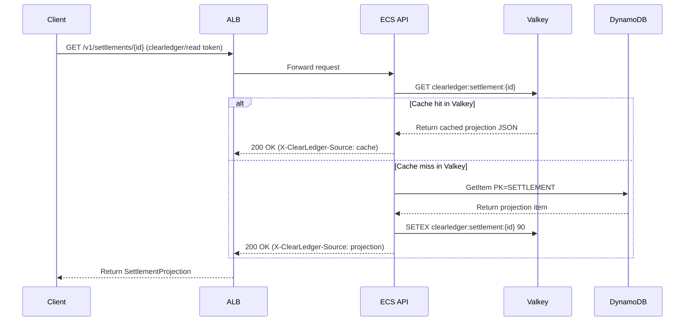
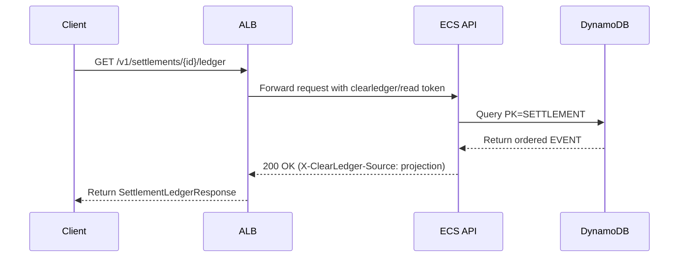
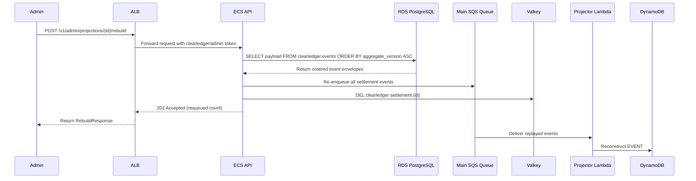
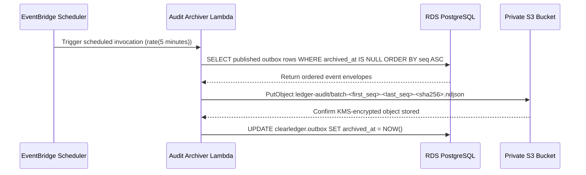

# ClearLedger Settlement Platform

## Introduction

ClearLedger is an event-sourced interbank clearing and settlement ledger running on the local Floci AWS control plane (`http://aws:4566`). The HTTP API covers the core settlement lifecycle: clients initiate a settlement instruction between two counterparties (`POST /v1/settlements`), append clearing and settlement ledger entries as the instruction moves through `VALIDATED`, `RESERVED`, `CLEARED`, `SETTLED`, `RECONCILED`, or `DISPUTED` (`POST /v1/settlements/{id}/entries`), read the current projected state (`GET /v1/settlements/{id}`), read the full ordered ledger history (`GET /v1/settlements/{id}/ledger`), or trigger an administrative projection rebuild (`POST /v1/admin/projections/{id}/rebuild`). I kept the Rust application binaries small and focused so the task measures cloud infrastructure engineering rather than application coding.

While a toy ledger could read and write from a single database table, splitting the write path, asynchronous event bus, read projection store, cache, and audit archive across RDS PostgreSQL, SQS, Lambda, DynamoDB, ElastiCache for Valkey, and S3 forces the agent to solve real distributed-systems and cloud operations problems. Accepted writes must survive an SQS queue outage through a transactional outbox table in PostgreSQL, out-of-order or duplicate SQS deliveries must not regress DynamoDB projections, poison messages must isolate to a dead-letter queue via `ReportBatchItemFailures` after 4 attempts, database constraints and PL/pgSQL triggers must reject illegal state regressions and tampered envelopes at the relational layer, and `deploy.sh` must reconcile both control-plane drift and multi-store data-plane drift without losing durable data.

The application is pre-built into four container images so each workload runs under its own least-privilege IAM role:

1. **API image (`clearledger/api:1.0.0`)**: Runs on ECS Fargate (`desired_count = 2` across two availability zones) behind an internet-facing Application Load Balancer. It validates Cognito JWTs, commits settlements, events, outbox rows, and idempotency keys to RDS PostgreSQL, serves read projections from Valkey and DynamoDB, and exposes `/health/live` and `/health/ready`.
2. **Projector image (`clearledger/projector:1.0.0`)**: Runs as a container-based AWS Lambda function triggered by an SQS event source mapping (`batch_size = 5`, `ReportBatchItemFailures`). It writes ordered `EVENT#*` items and monotonically updates `STATE` items in DynamoDB, then invalidates stale Valkey cache keys.
3. **Outbox relay image (`clearledger/relay:1.0.0`)**: Runs as a container-based AWS Lambda function triggered every minute (`rate(1 minute)`) by EventBridge Scheduler. It scans `clearledger.outbox` for rows with `published_at IS NULL`, publishes them to the main SQS queue in batches of 50 (`OUTBOX_BATCH_SIZE = 50`), and sets `published_at`.
4. **Audit archiver image (`clearledger/archiver:1.0.0`)**: Runs as a container-based AWS Lambda function triggered every five minutes (`rate(5 minutes)`) by EventBridge Scheduler. It reads published outbox rows with `archived_at IS NULL`, writes deterministic NDJSON batches (`ledger-audit/batch-<first_seq>-<last_seq>-<sha256_prefix>.ndjson`) to S3, and marks `archived_at`.

## Infrastructure Used

| Cloud service | Role in the system and connected components |
|---|---|
| **VPC** | Provides the two-AZ network (`us-east-1a` and `us-east-1b`) with two public subnets (attached to an Internet Gateway for the ALB), two private subnets (hosting ECS tasks, RDS, and Valkey with no IGW route), and four dedicated security groups (`alb`, `ecs`, `rds`, `valkey`). |
| **Application Load Balancer** | Accepts public HTTP traffic on port `80` in the public subnets and forwards requests to healthy ECS Fargate API tasks on port `8080` using `/health/ready` health checks. |
| **ECS Fargate** | Runs two warm API tasks (`desired_count = 2`) across the private subnets with Container Insights enabled on the cluster and automatic task replacement if a task stops. |
| **RDS PostgreSQL** | Runs a PostgreSQL 16 (`db.t4g.micro`) instance in the private subnets as the system of record. Stores `clearledger.settlements`, `clearledger.events`, `clearledger.outbox`, and `clearledger.idempotency_keys`, along with the relational `CHECK` / `FOREIGN KEY` constraints, PL/pgSQL triggers, and partial indexes initialized by `deploy.sh`. Connected to by the ECS API, Outbox Relay Lambda, and Audit Archiver Lambda. |
| **SQS (Main Queue and DLQ)** | Buffers domain events between the ECS API / Outbox Relay Lambda and the Projector Lambda (`visibility_timeout_seconds = 3`, `receive_wait_time_seconds = 2`, `message_retention_seconds = 172800`). Failed messages redrive to the DLQ (`message_retention_seconds = 1209600`) after `maxReceiveCount = 4` receives. |
| **AWS Lambda** | Executes the three background container workers (`projector`, `outbox_relay`, `audit_archiver`) on SQS arrival or scheduled ticks, plus synchronous repair invocations during `deploy.sh` convergence. |
| **DynamoDB** | Stores the read projection (`PK = SETTLEMENT#<id>`, `SK = STATE`) and ordered event history (`SK = EVENT#<version:08d>`) with `PAY_PER_REQUEST` billing, the `AccountIndex` GSI (`GSI1PK = ACCOUNT#<account_id>`, `GSI1SK = SETTLEMENT#<id>`), point-in-time recovery, and KMS server-side encryption. Written by the Projector Lambda and queried by the ECS API. |
| **ElastiCache for Valkey** | Runs Valkey 8 (`cache.t4g.micro`) on port `6379` in the private subnets to cache `SettlementProjection` payloads (`clearledger:settlement:<id>`) with a 90-second TTL (`CACHE_TTL_SECONDS = 90`). Read and populated by the ECS API; invalidated on writes by the ECS API and Projector Lambda. |
| **Cognito** | Hosts the User Pool, the `clearledger` resource server, and three `client_credentials` app clients issuing JWTs scoped to `clearledger/read`, `clearledger/write`, and `clearledger/admin`. Verified by the ECS API via the pool's JWKS endpoint. |
| **EventBridge Scheduler** | Triggers the Outbox Relay Lambda on `rate(1 minute)` and the Audit Archiver Lambda on `rate(5 minutes)` using the dedicated `scheduler` IAM role. |
| **S3** | Stores immutable, versioned, KMS-encrypted NDJSON audit batches under `ledger-audit/batch-*.ndjson` with all four public access block flags enabled. Written by the Audit Archiver Lambda. |
| **IAM** | Defines six separate roles (`ecs_execution`, `ecs_task`, `projector`, `relay`, `archiver`, `scheduler`) with service-specific trust policies and resource-scoped inline or attached policies (including prefix-scoped S3 object writes without `s3:DeleteObject` and per-workload KMS and CloudWatch Log Group isolation). |
| **KMS** | Provides four customer-managed keys and aliases (`database`, `messaging`, `projection`, `audit`) with `enable_key_rotation = true` and a 10-day deletion window (`10..30` days). |
| **CloudWatch Logs** | Collects structured JSON logs containing `correlationId` across four dedicated log groups (`/clearledger/<prefix>/api`, `/projector`, `/outbox-relay`, `/audit-archiver`) with at least 14 days of retention. |

**Floci runtime vs. control-plane enforcement:** Floci runs real container workloads for ECS Fargate, RDS PostgreSQL, ElastiCache for Valkey, and AWS Lambda, and executes live SQS redrive, DynamoDB conditional writes/GSI queries, S3 object versioning, and Cognito OAuth2 token issuance. However, Floci records VPC security group ingress/egress rules, KMS key rotation/encryption settings, and IAM role policies in its control plane (and evaluates IAM policies via `SimulatePrincipalPolicy`) rather than enforcing kernel-level packet filtering or runtime IAM/KMS access denials on container network sockets. Accordingly, the verifier tests security groups, KMS bindings, and IAM least-privilege policies through Terraform state inspection, live AWS control-plane queries, and `simulate_principal_policy`, while testing Cognito JWT validation and non-hierarchical scope enforcement directly against the live HTTP API.

## Operational Flows

Each diagram below traces one end-to-end operational flow through the services involved in that path.

### 1. Authenticate and reach the API

Every protected endpoint requires a Cognito Bearer JWT carrying the exact scope for that route (`clearledger/read`, `clearledger/write`, or `clearledger/admin`). The client requests an access token from Cognito using the `client_credentials` grant and sends the HTTP request to the Application Load Balancer. The ALB forwards the request to one of the two ECS Fargate API tasks, which validates the JWT signature against Cognito's JWKS keys, checks the issuer, audience (`AUTH_AUDIENCES`), expiration, and scope, and dispatches the request.



### 2. Initiate a new settlement

When a client calls `POST /v1/settlements`, the API opens a SQL transaction on RDS PostgreSQL and inserts three records atomically:

1. The settlement row in `clearledger.settlements` at `version = 1` (`current_status = 'INITIATED'`, `entry_count = 0`).
2. The `SettlementInitiated` event row in `clearledger.events`.
3. The transactional outbox row in `clearledger.outbox` with `published_at = NULL`, plus the idempotency record in `clearledger.idempotency_keys`.

PostgreSQL `CHECK` constraints and triggers validate party separation (`btrim(debit_party) <> btrim(credit_party)`), string length bounds, and JSONB envelope coherence before the transaction commits. After commit, the API performs a best-effort publish to the main SQS queue, updates `published_at` if SQS accepts the message, and returns `201 Created`. The Projector Lambda receives the message from SQS, writes `EVENT#00000001` and `STATE` to DynamoDB, and invalidates Valkey.



### 3. Append a clearing or settlement ledger entry

Calling `POST /v1/settlements/{id}/entries` appends the next lifecycle transition (`VALIDATED`, `RESERVED`, `CLEARED`, `SETTLED`, `RECONCILED`, or `DISPUTED`) using an `Idempotency-Key` header and `expectedVersion`. Inside PostgreSQL, the API locks the settlement row, checks `clearledger.idempotency_keys`, and validates `expectedVersion`.

- If the same `Idempotency-Key` and identical payload were already committed, the API returns `200 OK` with `idempotentReplay: true` without creating a duplicate event.
- If `expectedVersion` matches the current aggregate version and the transition satisfies the PostgreSQL lifecycle triggers, the API increments `version` and `entry_count`, inserts `LedgerEntryRecorded` into `clearledger.events` and `clearledger.outbox`, invalidates Valkey, publishes to SQS, and returns `202 Accepted`.
- If the idempotency key is reused with a different payload or `expectedVersion` is stale, the API returns `409 Conflict`. If the transition violates a domain invariant (such as regressing from `CLEARED` to `RESERVED` or transitioning out of terminal `RECONCILED`), PostgreSQL raises a constraint/trigger error that the API maps to `400 Bad Request`.



### 4. Read current settlement state

When a client calls `GET /v1/settlements/{id}`, the API checks Valkey (`clearledger:settlement:{id}`) first. On a cache hit, it returns the cached JSON immediately with `X-ClearLedger-Source: cache`. On a cache miss, it reads the `STATE` item from DynamoDB (`PK = SETTLEMENT#<id>`, `SK = STATE`), caches the serialized projection in Valkey for 90 seconds (`CACHE_TTL_SECONDS = 90`), and returns `200 OK` with `X-ClearLedger-Source: projection`. PostgreSQL is never queried on the read path; if the projection is not in DynamoDB yet, the endpoint returns `404 Not Found`.



### 5. Read the ordered settlement ledger history

Calling `GET /v1/settlements/{id}/ledger` queries DynamoDB for all items under `PK = SETTLEMENT#<id>` where `SK` begins with `EVENT#`, returning the ordered lifecycle events in ascending version order (`EVENT#00000001` .. `EVENT#<version:08d>`) with `X-ClearLedger-Source: projection`.



### 6. Rebuild a corrupted or deleted DynamoDB projection

If a settlement's DynamoDB items are deleted or corrupted, an operator with a `clearledger/admin` token can call `POST /v1/admin/projections/{id}/rebuild`. The API reads all committed events for that settlement from `clearledger.events` in ascending `aggregate_version` order, re-publishes each event envelope to the main SQS queue, and deletes the Valkey cache key so the Projector Lambda reconstructs the DynamoDB state and event items.



### 7. Recover writes and reconcile derived stores after an SQS outage

If the main SQS queue and its Lambda event source mapping are deleted while clients submit new settlements and ledger entries, the API continues accepting writes (`201` and `202`) because the PostgreSQL transaction commits before the best-effort SQS send. Those events remain in `clearledger.outbox` with `published_at = NULL`, and `GET /v1/settlements/{id}` returns `404` until the messaging path is restored.

When the operator or verifier re-runs `deploy.sh`:
1. Terraform/OpenTofu recreates the deleted SQS queues, EventBridge schedules, and Lambda event source mapping, reconciles any drifted queue, log group, schedule, or Lambda environment settings, and refreshes `manifest.json`.
2. `deploy.sh` invokes the Outbox Relay Lambda until all rows with `published_at IS NULL` are published and marked delivered.
3. `deploy.sh` reconciles DynamoDB (`STATE`, `EVENT#*`, and `AccountIndex` GSI attributes) and Valkey 1-to-1 against `clearledger.settlements` and `clearledger.events`, deleting any orphan partitions or stray items/keys and rebuilding any settlement whose projection or event items drifted.
4. `deploy.sh` reconciles S3 objects under `ledger-audit/` against `clearledger.outbox`, removing stray, tampered, duplicate, or out-of-order batch files, resetting `archived_at = NULL` for any committed outbox rows missing from S3, and invoking the Audit Archiver Lambda until every outbox event is archived once.

```mermaid
sequenceDiagram
    autonumber
    participant Verifier
    participant Client
    participant API as ECS API
    participant RDS as RDS PostgreSQL
    participant SQS as Main SQS Queue
    participant Deploy as deploy.sh
    participant Relay as Outbox Relay Lambda
    participant Projector as Projector Lambda
    participant DDB as DynamoDB
    participant Archiver as Audit Archiver Lambda

    Verifier->>SQS: Delete ESM and SQS queues; inject DDB/Valkey/S3 drift
    Client->>API: POST /v1/settlements and /entries
    API->>RDS: Commit settlement, event, and unpublished outbox rows
    RDS-->>API: Transaction committed
    API-xSQS: Best-effort SendMessage fails (queue missing)
    API-->>Client: Return 201 / 202 from durable PostgreSQL commit
    Verifier->>Deploy: Re-run deploy.sh
    Deploy->>SQS: Recreate SQS queues, schedules, and ESM via Terraform/OpenTofu
    Deploy->>Relay: Invoke Outbox Relay until published_at IS NULL count is 0
    Relay->>RDS: Fetch unpublished outbox rows
    RDS-->>Relay: Return pending event envelopes
    Relay->>SQS: Publish pending events to restored queue
    Relay->>RDS: Stamp published_at
    SQS->>Projector: Deliver recovered events
    Projector->>DDB: Write recovered projections
    Deploy->>Projector: Purge orphan/stray DDB & Valkey items and rebuild drifted partitions
    Deploy->>Archiver: Reconcile S3 ledger-audit/ batches and archive unarchived outbox rows
```

### 8. Archive published events to Amazon S3

Every five minutes (`rate(5 minutes)`), EventBridge Scheduler invokes the Audit Archiver Lambda. The archiver selects published outbox rows where `archived_at IS NULL` ordered by `seq ASC`, validates each envelope, writes a newline-delimited JSON batch to `s3://<audit_bucket>/ledger-audit/batch-<first_seq:08d>-<last_seq:08d>-<16_char_sha256_hex>.ndjson`, and updates `archived_at` in PostgreSQL.



## Score

The verifier grades the submission across **19 scored test blocks** grouped into **6 categories** totaling **100 points**. Only a score of **100 / 100** with all prerequisite gates passing and no score caps triggered counts as a pass.

| Category | Points |
|---|---:|
| Core product behavior | 24 |
| Recovery | 20 |
| Architecture and deployment | 17 |
| Lifecycle | 15 |
| Asynchronous processing | 13 |
| Security and observability | 11 |
| **Total** | **100** |

The 19 test blocks are grouped below from highest-weighted category to lowest, and ordered within each category from highest point value to lowest:

| Category | Scored test block | What the test proves | Points |
|---|---|---|---:|
| Core product behavior | Settlement workflow | Executes 8 to 10 randomized settlement lifecycles with 3 to 5 ledger entries each through the ALB, verifies DynamoDB projections and ordered ledger histories, and confirms that invalid domain writes (identical or whitespace-padded `debitParty` and `creditParty`, backward status regressions, transitions out of terminal `RECONCILED`, whitespace-only memos, and duplicate per-settlement `entryId` values) are rejected with `400 Bad Request` via PostgreSQL constraints and triggers. | 9 |
| Core product behavior | Idempotency and concurrency | Verifies that sequential and 6-way concurrent replays of the same `Idempotency-Key` commit once and return `idempotentReplay: true`, reusing an `Idempotency-Key` with a modified payload returns `409 Conflict`, stale `expectedVersion` writes return `409 Conflict`, and a 5-way concurrent race on the same `expectedVersion` yields exactly one `202 Accepted` winner and four `409 Conflict` responses. | 8 |
| Core product behavior | Projection and cache | Verifies that evicting the Valkey key causes the next `GET /v1/settlements/{id}` to read from DynamoDB (`X-ClearLedger-Source: projection`) and populate Valkey with a TTL in `(0, 90]`, the subsequent read hits Valkey (`X-ClearLedger-Source: cache`), and appending a new ledger entry invalidates the cached projection. | 7 |
| Recovery | Outbox recovery | Deletes the projector event source mapping, EventBridge schedule, and SQS queues while injecting DynamoDB (`STATE`, `EVENT#*`, `AccountIndex` GSI), Valkey, and S3 audit corruption, confirms that new settlement writes still commit in PostgreSQL while `GET` returns `404`, and verifies that re-running `deploy.sh` restores the queues and ESM, drains unpublished outbox rows, and reconciles DynamoDB, Valkey, and S3 1-to-1 against PostgreSQL. | 6 |
| Recovery | Projection rebuild | Deletes a settlement's `STATE` and `EVENT#*` items from DynamoDB and evicts its Valkey key so `GET /v1/settlements/{id}` returns `404`, then calls `POST /v1/admin/projections/{id}/rebuild` with an admin token and verifies that all events are replayed from PostgreSQL through SQS to reconstruct the projection and ledger trail. | 5 |
| Recovery | ECS task replacement | Stops one running ECS Fargate API task and verifies that `/health/ready` and settlement reads stay available through the remaining task while the ECS service launches a replacement task to return to 2 running tasks. | 5 |
| Recovery | RDS reboot recovery | Reboots the RDS PostgreSQL instance, waits for `/health/ready` to report `postgres = "UP"`, and verifies that all previously committed settlements remain intact and new settlement writes succeed. | 4 |
| Architecture and deployment | Live ingress and compute | Queries live EC2, ELBv2, and ECS APIs to verify the two-AZ VPC, subnets, security groups (`alb`, `ecs`, `rds`, `valkey`), internet-facing ALB, listener, `/health/ready` target group, ECS cluster (`containerInsights = "enabled"`), task definition role bindings, at least 2 running Fargate tasks in private subnets, and live `/health/ready` status across `postgres`, `dynamodb`, `sqs`, and `valkey`. | 5 |
| Architecture and deployment | Live data and event graph | Queries live RDS, PostgreSQL, SQS, Lambda, EventBridge Scheduler, DynamoDB, ElastiCache, and S3 APIs to verify the `clearledger` tables, indexes, and savepoint-tested `CHECK` / `FOREIGN KEY` / trigger invariants, SQS and DLQ KMS encryption and redrive policy, container Lambda roles and environment variables, enabled schedules, DynamoDB `AccountIndex` GSI and PITR, Valkey node, and S3 versioning, KMS encryption, and public access blocks. | 5 |
| Architecture and deployment | Infrastructure managed with Terraform or OpenTofu | Runs `terraform validate` / `tofu validate`, checks that all required AWS resource types and at least 25 `ClearLedgerDeployment`-tagged resources are managed in `infra/terraform.tfstate`, and verifies that `deploy.sh` does not create scored resources with imperative `aws` CLI commands. | 3 |
| Architecture and deployment | Declared compute and ingress | Inspects `terraform.tfstate` to verify the declared VPC, public and private route table associations, security group ingress and egress rules, ALB, target group, listener, and ECS Fargate cluster, service, and task definition environment variables (`CACHE_TTL_SECONDS = "90"`, `AUTH_ISSUER`, `AUTH_JWKS_URL`, `AUTH_AUDIENCES`). | 2 |
| Architecture and deployment | Declared data and messaging | Inspects `terraform.tfstate` and parsed IaC configuration to verify RDS PostgreSQL 16 with `database` KMS encryption, main SQS queue and DLQ with `messaging` KMS encryption and `maxReceiveCount = 4`, three container Lambdas (`OUTBOX_BATCH_SIZE = "50"`, `AUDIT_PREFIX = "ledger-audit/"`), SQS ESM (`batch_size = 5`, `ReportBatchItemFailures`), two EventBridge schedules, DynamoDB (`PK`/`SK`, `AccountIndex`, PITR, `projection` KMS SSE), ElastiCache Valkey 8, and S3 (`Enabled` versioning, `audit` KMS SSE, public access block). | 2 |
| Lifecycle | Clean destroy | Plants out-of-band prefix-scoped operational artifacts (inline and multi-version managed IAM policies, breakglass IAM role, versioned S3 bucket, DynamoDB table, SQS queue, EventBridge schedule, KMS key and alias, and CloudWatch Log Group), runs `destroy.sh`, and verifies that `terraform.tfstate` has zero managed resources, all deployment and prefix-scoped resources are removed, and all pre-existing baseline (`cl-base-*`) resources remain untouched. | 8 |
| Lifecycle | Stable deployment | Injects control-plane drift (SQS `VisibilityTimeout` and `ReceiveMessageWaitTimeSeconds`, DLQ `MessageRetentionPeriod`, disabled EventBridge schedules, reduced log retention, mutated Lambda `OUTBOX_BATCH_SIZE` and `AUDIT_PREFIX`, and out-of-band inline and attached IAM role policies) and data-plane drift (unpublished/unarchived outbox row, corrupted DynamoDB `STATE` / `EVENT#*` / `AccountIndex` items, poisoned Valkey keys, and tampered/orphan/versioned S3 audit batches and delete markers), re-runs `deploy.sh`, and verifies full control-plane and 1-to-1 data-plane convergence without replacing RDS, DynamoDB, or S3. | 7 |
| Asynchronous processing | Backlog recovery | Disables the projector SQS event source mapping, submits 25 events across 5 settlements (confirming `GET` returns `404` while buffered in SQS), re-enables the mapping, and verifies that all 5 settlements drain and project to their final versions. | 7 |
| Asynchronous processing | Duplicate and invalid messages | Re-delivers duplicate and stale (`v1`) events over SQS, invokes the projector with deterministic out-of-order (`v3` -> `v1` -> `v2`) and 6-way concurrent scrambled batches to prove projections never regress, and sends a malformed poison message to verify that it routes to the DLQ after 4 failed receives without blocking valid messages. | 6 |
| Security and observability | Live security graph | Queries live IAM, KMS, Cognito, and CloudWatch Logs APIs (plus `simulate_principal_policy`) to verify all 6 IAM roles, trust policies, least-privilege `Allow` boundaries, and explicit `Effect = "Deny"` guardrails, 4 enabled customer-managed KMS keys with key rotation enabled and aliases attached, Cognito resource server and client scopes, and 4 log groups with `retentionInDays >= 14`. | 5 |
| Security and observability | Declared security | Inspects `terraform.tfstate` to verify the 6 IAM roles and policies (no wildcard actions or resources, explicit `Effect = "Deny"` guardrails, prefix-scoped S3 writes without `s3:DeleteObject`, per-role KMS and log group isolation), 4 KMS keys (`enable_key_rotation = true`, `deletion_window_in_days` in `10..30`) and aliases, Cognito user pool/resource server/clients, and 4 CloudWatch Log Groups (`retention_in_days >= 14`). | 3 |
| Security and observability | Authorization, audit and logs | Verifies `401` on missing/forged tokens and `403` across the full cross-scope matrix (`read`, `write`, `admin`), confirms that S3 audit batches validate against `events.schema.json`, and checks that all four CloudWatch Log Groups record `correlationId` without leaking `db_password` or Cognito `client_secret` values. | 3 |
| **Total** | | | **100** |

### Prerequisite Gates and Score Caps

Before running the 19 scored test blocks, `tests/suite/conftest.py` and `tests/suite/scoring.py` check four prerequisite gates. If any gate fails, execution stops and the final score is **`0`**:

1. **`submission_layout`**: `/workspace/submission/deploy.sh`, `/workspace/submission/destroy.sh`, and `/workspace/submission/infra/` (with `.tf` or `.tofu` files) must exist.
2. **`deploy_succeeded`**: `/workspace/submission/deploy.sh` must exit `0` within 720 seconds and write `/workspace/submission/infra/terraform.tfstate`.
3. **`manifest_valid`**: `/workspace/submission/manifest.json` must exist (`<= 1 MiB`), validate against `/workspace/contracts/schemas/manifest.schema.json`, and match `config.json`'s `resource_prefix`.
4. **`service_reachable`**: `GET /health/live` and `GET /health/ready` against `manifest.service_url` must return HTTP `200`.

In addition, three score caps override the raw point total if a critical reliability, security, or lifecycle rule is broken:

- **Accepted write loss or corruption (`accepted_write_loss`, cap: `49`)**: Applied if any settlement initiation (`201`) or ledger entry (`202`) accepted by the API is lost or corrupted in PostgreSQL or the rebuilt projection during normal workflow execution, SQS outage recovery, or RDS reboot recovery.
- **Authorization escalation or secret leak (`auth_escalation`, cap: `49`)**: Applied if an unauthenticated request or an under-scoped token (`read`, `write`, or `admin` outside its permitted routes) is accepted, or if `db_password` or any Cognito `client_secret` appears in CloudWatch Logs.
- **Teardown resource leak or baseline damage (`cleanup_leak`, cap: `79`)**: Applied if `destroy.sh` exits non-zero, leaves managed resources in `terraform.tfstate`, leaks prefix-scoped resources in the cloud account, or deletes/disables any pre-existing baseline (`cl-base-*`) resource.
