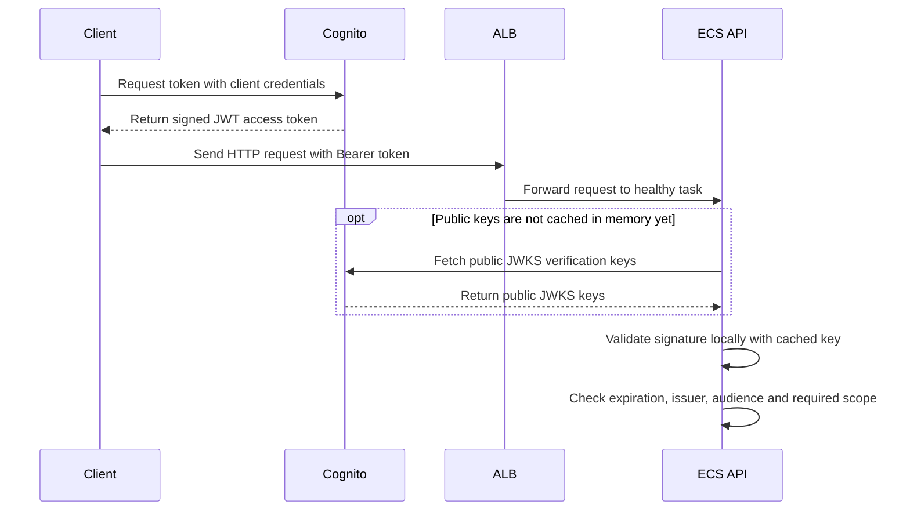
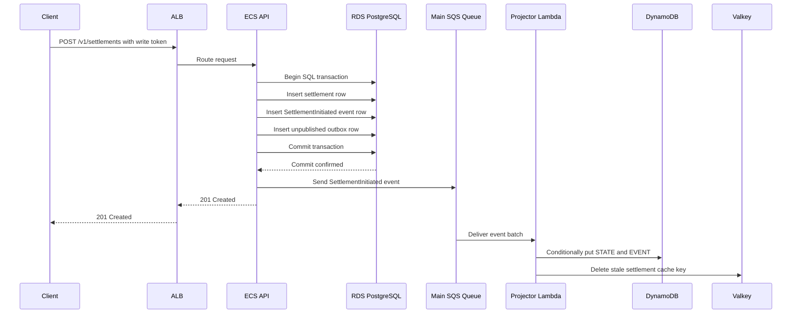
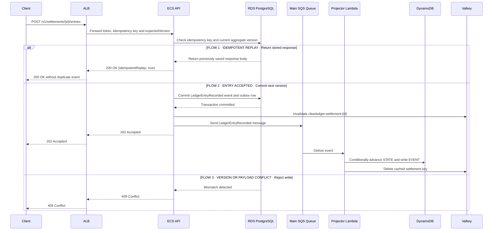
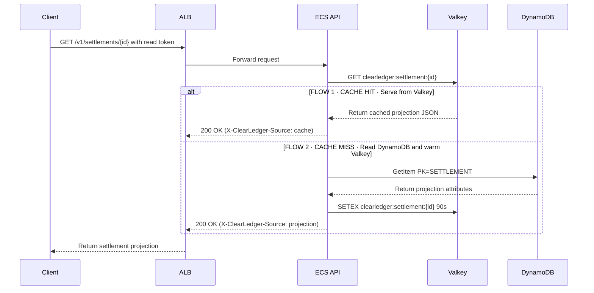
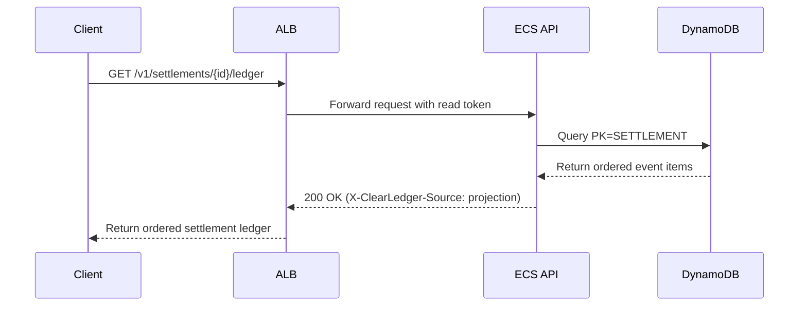
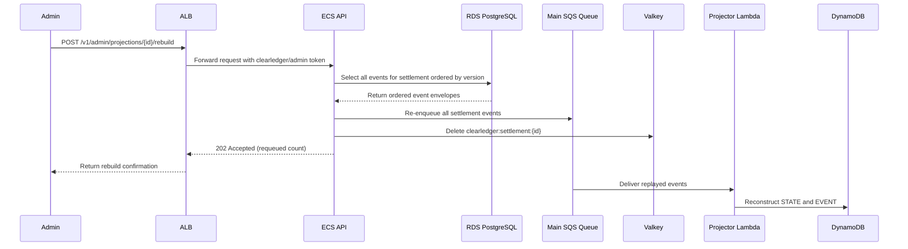
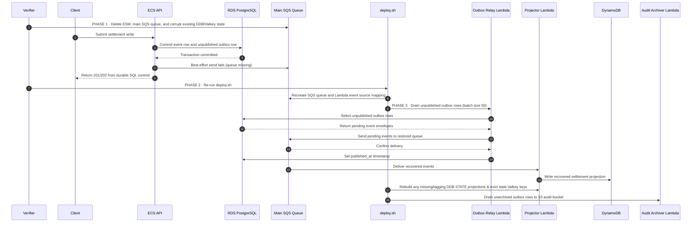
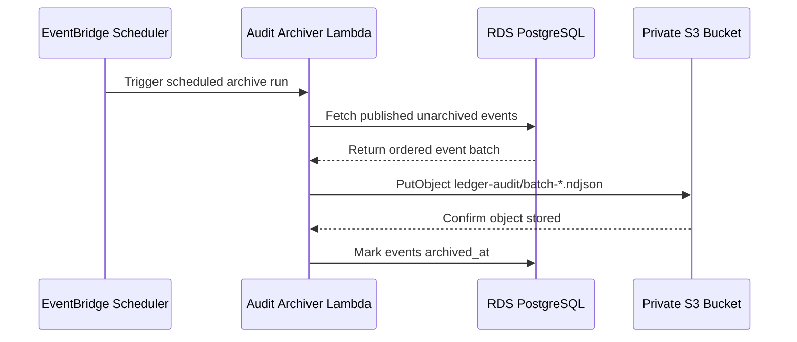

# ClearLedger Settlement Platform

## Introduction

ClearLedger is an event-sourced interbank clearing and settlement ledger running on an AWS-compatible control plane (`http://aws:4566`). The HTTP surface is intentionally focused: clients initiate a settlement instruction between two counterparties, append clearing and settlement ledger entries (such as `VALIDATED`, `RESERVED`, `CLEARED`, `SETTLED`, `RECONCILED`, or `DISPUTED`), and query either the latest settlement state or the full ordered ledger trail. I kept the application code compact because the benchmark is not testing whether an agent can write Rust HTTP handlers—it is testing whether an agent can provision and operate a resilient multi-service AWS architecture where accepted writes survive messaging outages, corrupted read projections can be rebuilt from the immutable event log, and every component runs with least-privilege IAM roles and customer-managed KMS keys.

Even though a basic ledger prototype could run on a single PostgreSQL instance, I split the write and read paths across RDS PostgreSQL, SQS, Lambda, DynamoDB, ElastiCache for Valkey, and S3. That separation forces the model to handle real cloud reliability and recovery mechanics: transactional outbox recovery when an SQS queue is deleted and recreated, DynamoDB Global Secondary Index (`AccountIndex`) and point-in-time recovery configuration, partial batch failure reporting (`ReportBatchItemFailures`) with a dead-letter queue (`maxReceiveCount = 4`), non-default worker tuning parameters (`CACHE_TTL_SECONDS = 90`, `OUTBOX_BATCH_SIZE = 50`, `AUDIT_PREFIX = ledger-audit/`), and clean idempotent Terraform convergence.

I package the application into four pre-built container images so each runtime role stays isolated with its own IAM role:

1. **API image (`clearledger/api:1.0.0`):** serves only the HTTP endpoints. The model runs this on ECS Fargate with two tasks across two availability zones behind an Application Load Balancer.
2. **Projector image (`clearledger/projector:1.0.0`):** consumes domain events from the main SQS queue, updates the settlement projection and event history in DynamoDB, and invalidates stale keys in Valkey. The model runs this as a container-based Lambda function wired to SQS via an event source mapping.
3. **Outbox relay image (`clearledger/relay:1.0.0`):** scans PostgreSQL for committed outbox rows that have not been published to SQS yet and delivers them in batches. This runs as a container-based Lambda function invoked every minute by EventBridge Scheduler.
4. **Audit archiver image (`clearledger/archiver:1.0.0`):** reads published events from PostgreSQL and writes deterministic NDJSON batches under `ledger-audit/batch-*.ndjson` in a private, KMS-encrypted S3 bucket. This runs as a third container-based Lambda function invoked every five minutes by EventBridge Scheduler.

Only the ECS Fargate API service keeps two warm tasks running continuously to serve low-latency HTTP traffic; the three background workers run as serverless Lambda functions on queue arrival or scheduled ticks.

## Infrastructure used

| Cloud service | How it is used in this task |
|---|---|
| **VPC** | Two-AZ virtual network (`us-east-1a` and `us-east-1b`) with public subnets for the load balancer, private subnets for ECS, RDS, and Valkey, and four security groups enforcing least-privilege network paths. |
| **Application Load Balancer** | Public HTTP entry point (`port 80`) that routes traffic across both availability zones to healthy ECS API tasks on `port 8080` using `/health/ready`. |
| **ECS Fargate** | Runs two warm API container tasks (`desired_count = 2`) and automatically replaces tasks if an instance is stopped. |
| **RDS PostgreSQL** | Durable system of record (`postgres 16`, `db.t4g.micro`) storing settlement aggregates, the immutable event log, transactional outbox rows, and idempotency keys under the `clearledger` schema initialized by `deploy.sh`. |
| **SQS (main queue and DLQ)** | Buffers domain events between the API/relay and the projector Lambda (`visibility_timeout_seconds = 3`, `receive_wait_time_seconds = 2`) and routes poison messages to a dead-letter queue after 4 failed receives (`maxReceiveCount = 4`). |
| **AWS Lambda** | Runs the projector, outbox relay, and audit archiver container images on demand without idle compute overhead. |
| **DynamoDB** | Stores the queryable settlement projection (`PK = SETTLEMENT#<id>`, `SK = STATE`) and ordered ledger items (`SK = EVENT#<version>`) with a `GSI1PK`/`GSI1SK` `AccountIndex` secondary index, KMS encryption, and point-in-time recovery enabled. |
| **ElastiCache for Valkey** | Caches hot settlement projections (`clearledger:settlement:<id>`) on Valkey 8 (`cache.t4g.micro`) with a 90-second TTL (`CACHE_TTL_SECONDS = 90`) in front of DynamoDB. |
| **Cognito** | Hosts the OAuth2 user pool, resource server (`clearledger`), and three separate app clients issuing access tokens for `clearledger/read`, `clearledger/write`, and `clearledger/admin`. |
| **EventBridge Scheduler** | Invokes the outbox relay Lambda on `rate(1 minute)` and the audit archiver Lambda on `rate(5 minutes)`. |
| **S3** | Stores versioned, KMS-encrypted NDJSON audit files (`ledger-audit/batch-*.ndjson`) with all public access blocked. |
| **IAM** | Provides six dedicated execution and runtime roles (`ecs_execution`, `ecs_task`, `projector`, `relay`, `archiver`, `scheduler`) scoped to exact resource ARNs. |
| **KMS** | Supplies four customer-managed keys and aliases (`database`, `messaging`, `projection`, `audit`) with automatic key rotation enabled and a 10-day deletion window. |
| **CloudWatch Logs** | Captures structured JSON logs from the API and all three Lambda functions in four dedicated log groups with at least 14 days of retention. |

## Operational flows

Each diagram below traces one operational path through the platform and includes only the services participating in that flow.

### 1. Authenticate and reach the API

Every business endpoint requires a Cognito JWT carrying the matching scope (`clearledger/read`, `clearledger/write`, or `clearledger/admin`). The client requests an access token from Cognito using the `client_credentials` grant, then sends the HTTP request to the Application Load Balancer. The ALB forwards the request to one of the two ECS Fargate API tasks. If the API task does not have the Cognito signing keys cached yet, it fetches the JWKS document once, verifies the JWT signature, issuer, audience (`AUTH_AUDIENCES`), token use, expiration, and scope locally, and then executes the handler.

### 2. Initiate a new settlement

When a client calls `POST /v1/settlements`, the API opens a single SQL transaction in RDS PostgreSQL and writes three records atomically:

1. The **settlement aggregate row** in `clearledger.settlements` recording the settlement ID, account ID, reference, debit and credit counterparties, and initial version (`1`).
2. The **immutable event row** in `clearledger.events` recording `SettlementInitiated`.
3. The **transactional outbox row** in `clearledger.outbox` holding the serialized event envelope with `published_at = NULL`.

Because all three inserts share one database transaction, PostgreSQL guarantees that we never commit a settlement without queuing its event in the outbox. Immediately after commit, the API performs a best-effort publish to the main SQS queue, marks `published_at` if SQS accepts the message, and returns `201 Created`. The Projector Lambda then consumes the SQS message, writes the `EVENT#00000001` item and conditional `STATE` item into DynamoDB, and clears any stale Valkey entry.

### 3. Append a clearing or settlement ledger entry

Calling `POST /v1/settlements/{id}/entries` appends the next lifecycle transition (for example, `VALIDATED`, `RESERVED`, `CLEARED`, or `SETTLED`) without overwriting prior ledger entries. The caller passes an `Idempotency-Key` header and `expectedVersion`. Inside RDS PostgreSQL, the API locks the aggregate row, checks `clearledger.idempotency_keys` for an existing key, and verifies `expectedVersion`.

That produces one of three deterministic outcomes: an idempotent replay (`200 OK` with `idempotentReplay: true`) if the exact request was already committed, a version increment (`202 Accepted`) that writes `LedgerEntryRecorded` and invalidates Valkey, or a `409 Conflict` if either the idempotency payload differs or `expectedVersion` is stale. When the Projector Lambda applies the event in DynamoDB, it writes `EVENT#<version>` with `attribute_not_exists(PK) AND attribute_not_exists(SK)` and updates `STATE` inside an optimistic concurrency loop guarded by `#version = :expected_version`. If standard SQS delivers messages out of order or concurrent Lambda invocations race on the same settlement, older versions never overwrite a newer projected state.

### 4. Read current settlement state

When a client calls `GET /v1/settlements/{id}`, the API checks Valkey (`clearledger:settlement:{id}`) first. On a cache hit, it returns the projection immediately with `X-ClearLedger-Source: cache`. On a cache miss, it reads the `STATE` item from DynamoDB (`PK = SETTLEMENT#<id>`, `SK = STATE`), writes the serialized JSON into Valkey with a 90-second TTL (`CACHE_TTL_SECONDS = 90`), and returns the response with `X-ClearLedger-Source: projection`. PostgreSQL is never queried on the read path—if the projection has not arrived in DynamoDB yet or was deleted, `GET /v1/settlements/{id}` returns `404` until projection delivery completes or an administrator triggers a rebuild.

### 5. Read the full settlement ledger history

Calling `GET /v1/settlements/{id}/ledger` returns every committed lifecycle event in ascending version order. Because Valkey only caches the latest summary state, ledger queries go directly to DynamoDB and query all items under `PK = SETTLEMENT#<id>` where `SK` begins with `EVENT#`.

### 6. Rebuild a corrupted or deleted DynamoDB projection

If the DynamoDB items for a settlement are deleted or corrupted (causing `GET /v1/settlements/{id}` to return `404`), an operator holding a `clearledger/admin` token can call `POST /v1/admin/projections/{id}/rebuild`. The API queries RDS PostgreSQL for all events belonging to that settlement ordered by `aggregate_version ASC`, re-enqueues each event envelope onto the main SQS queue, and evicts the Valkey cache key so the Projector Lambda reconstructs the DynamoDB items cleanly.

### 7. Recover writes and reconcile projections during an SQS outage

If the main SQS queue and its Lambda event source mapping are deleted while a client submits a settlement or ledger entry, the API still accepts the write (`201` or `202`) because the aggregate row, event row, and outbox row (`published_at = NULL`) commit inside RDS PostgreSQL before the API attempts the direct SQS publish. While the queue is missing, `GET /v1/settlements/{id}` returns `404` because the event cannot reach DynamoDB. Furthermore, if existing settlements have their DynamoDB projections, Valkey cache entries, or S3 audit batches corrupted during the incident, `deploy.sh` must self-heal the data plane before returning `0`:

1. **Induce the fault:** the verifier corrupts existing DynamoDB `STATE`, `EVENT#*`, and `AccountIndex` GSI items (along with planting stray items and orphan partitions), poisons Valkey cache entries, tampers with S3 audit batch objects, drifts Lambda/Scheduler configuration, deletes the projector Lambda event source mapping and the main/DLQ SQS queues, and then submits a new settlement and ledger entries. PostgreSQL commits the new writes durably with `published_at = NULL`, while `GET` returns `404`.
2. **Repair the control plane:** the verifier re-runs `deploy.sh`, which refreshes Terraform/OpenTofu state, recreates the missing SQS queues, schedules, and Lambda event source mapping, reconciles drifted worker configuration, and updates `/workspace/submission/manifest.json`.
3. **Reconcile the data plane inside `deploy.sh`:** before exiting `0`, `deploy.sh` invokes the Outbox Relay Lambda until all unpublished outbox rows (`published_at IS NULL`) are drained, reconciles DynamoDB (`STATE`, `EVENT#*`, and `AccountIndex` GSI) and Valkey (`clearledger:settlement:<id>`) 1-to-1 against `clearledger.settlements` and `clearledger.events` (purging any orphan or stray items and keys), and reconciles S3 `ledger-audit/` objects against `clearledger.outbox` before invoking the Audit Archiver Lambda so every committed event is archived once with its valid canonical key and SHA-256 digest.

### 8. Archive published events to Amazon S3

Every five minutes (`rate(5 minutes)`), EventBridge Scheduler triggers the Audit Archiver Lambda. The archiver queries RDS PostgreSQL for published outbox rows whose `archived_at` column is still `NULL`, validates each event envelope, writes a deterministic NDJSON object (`ledger-audit/batch-<first_seq>-<last_seq>-<sha256_prefix>.ndjson`) to the KMS-encrypted S3 audit bucket, and stamps `archived_at` in PostgreSQL.

## Score

The verifier evaluates the submission across **19 test blocks** grouped into **six categories** totaling **100 points**. A submission only passes when it satisfies all four prerequisite gates, achieves **100 / 100** across the scored blocks, and triggers no score caps.

| Category | Points |
|---|---:|
| Core product behavior | 24 |
| Recovery | 20 |
| Architecture and deployment | 17 |
| Lifecycle | 15 |
| Asynchronous processing | 13 |
| Security and observability | 11 |
| **Total** | **100** |

Here is what each scored test block checks and how points are distributed:

| Category | Scored test block | What its experiments prove | Points |
|---|---|---|---:|
| Core product behavior | Settlement workflow | 8–10 randomized settlement lifecycles with 3–5 clearing/settlement entries each commit cleanly, project into DynamoDB, return accurate state and ordered ledger histories through the ALB, and reject invalid domain transitions (trimmed self-dealing `debitParty == creditParty`, stage regressions, transitions out of terminal `RECONCILED`, whitespace-only memos, and duplicate per-settlement `entryId` values) with `400 Bad Request` via PostgreSQL constraints and triggers. | 9 |
| Core product behavior | Projection and cache | Deleting the Valkey key causes the next `GET /v1/settlements/{id}` to return `X-ClearLedger-Source: projection` and repopulate Valkey so the following read returns `X-ClearLedger-Source: cache`; writes invalidate the cached key. | 7 |
| Core product behavior | Idempotency and concurrency | Sequential and 6-way concurrent replays of the same `Idempotency-Key` commit only once (`idempotentReplay: true` on replays), reusing an `Idempotency-Key` with a mutated payload returns `409`, a stale `expectedVersion` returns `409`, and a 5-way concurrent race on the same `expectedVersion` produces exactly one `202` winner and four `409` conflicts. | 8 |
| Recovery | Outbox recovery | Deleting the projector Event Source Mapping, schedules, and SQS queues while corrupting existing DynamoDB `STATE`/`EVENT#*`/`AccountIndex` items, Valkey cache keys, and S3 audit batches does not block write acceptance in PostgreSQL, and re-running `deploy.sh` restores the queues/ESM, drains pending outbox rows, heals DynamoDB/Valkey/S3 1-to-1 against PostgreSQL, and purges orphan or stray items before exiting `0`. | 6 |
| Recovery | Projection rebuild | Deleting the DynamoDB `STATE` and `EVENT#` items and Valkey key causes `GET` to return `404` until `POST /v1/admin/projections/{id}/rebuild` replays the PostgreSQL event log through SQS. | 5 |
| Recovery | ECS task replacement | Stopping one running ECS task leaves `/health/ready` and existing settlement reads available via the remaining task while ECS schedules a replacement to return to 2 running tasks. | 5 |
| Recovery | RDS reboot recovery | Rebooting the RDS PostgreSQL instance preserves all previously committed settlement records and allows new writes to succeed once the instance returns healthy. | 4 |
| Architecture and deployment | Infrastructure managed with Terraform or OpenTofu | Validation (`terraform validate` or `tofu validate`) succeeds and `infra/terraform.tfstate` manages all required AWS resource types and tagged resources (combining `tags` and `tags_all`) for the deployment prefix without imperative CLI creation in `deploy.sh`. | 3 |
| Architecture and deployment | Declared compute and ingress | State declares the 2-AZ VPC, public/private subnets, 4 security groups (`alb`, `ecs`, `rds`, `valkey`, supporting both inline and standalone security group rule resources), internet-facing ALB + HTTP listener + `/health/ready` target group, and ECS Fargate service/task definition (`desired_count >= 2`, `CACHE_TTL_SECONDS = 90`, `AUTH_ISSUER`, `AUTH_JWKS_URL`, `AUTH_AUDIENCES` containing all 3 Cognito client IDs, and exact `ecs_execution` / `ecs_task` role bindings). | 2 |
| Architecture and deployment | Declared data and messaging | Resolved state and parsed IaC configuration declare RDS PostgreSQL 16 (`db.t4g.micro`, encrypted with `database` KMS key), SQS main queue (`visibility_timeout = 3`, `wait_time = 2`, `retention = 172800`) + DLQ (`retention = 1209600`, `maxReceiveCount = 4`, supporting both inline `redrive_policy` and standalone `aws_sqs_queue_redrive_policy`, both encrypted with `messaging` KMS key), 3 container Lambdas bound to their respective IAM roles (`OUTBOX_BATCH_SIZE = 50`, `AUDIT_PREFIX = ledger-audit/`), SQS ESM (`batch_size = 5`, `ReportBatchItemFailures`), 2 EventBridge schedules bound to the `scheduler` role, DynamoDB (`PK`/`SK`, `AccountIndex` GSI, `point_in_time_recovery = true`, SSE with `projection` KMS key), ElastiCache Valkey 8 (`cache.t4g.micro`), and S3 (`Enabled` versioning, `aws:kms` SSE with `audit` KMS key, public access block). | 2 |
| Architecture and deployment | Live ingress and compute | Live AWS inspection confirms the ALB, listener, target group, ECS cluster/service convergence (`>= 2` running tasks across `2` AZs), live task definition role attachments (`executionRoleArn` and `taskRoleArn`), and `/health/ready` responses (`postgres`, `dynamodb`, `sqs`, and `valkey` all `UP`) match `manifest.json`. | 5 |
| Architecture and deployment | Live data and event graph | Live AWS and PostgreSQL inspection confirms RDS and the initialized `clearledger` schema (`settlements`, `events`, `outbox`, `idempotency_keys`, 3 indexes, and savepoint-isolated relational `CHECK`, `FOREIGN KEY`, and trigger invariants), SQS queue and DLQ KMS encryption (`messaging` key) and redrive policy, Lambda container configurations and attached IAM roles, EventBridge schedules and target roles, DynamoDB `AccountIndex` GSI + `ENABLED` continuous backups (PITR), Valkey node, and S3 versioning, `aws:kms` bucket encryption (`audit` key), and public-access blocks. | 5 |
| Lifecycle | Stable deployment | Introducing multi-service control-plane drift (SQS `VisibilityTimeout`, DLQ `MessageRetentionPeriod`, disabled EventBridge schedules, lowered log retention, mutated Lambda `OUTBOX_BATCH_SIZE` and `AUDIT_PREFIX`) alongside data-plane drift (unpublished/unarchived outbox row, corrupted DynamoDB `STATE`/`EVENT#*`/`AccountIndex` items, poisoned Valkey cache, and tampered/orphan S3 audit batches) and re-running `deploy.sh` reconciles both control plane and data plane cleanly without replacing RDS, DynamoDB, or S3. | 7 |
| Lifecycle | Clean destroy | Planting out-of-band prefix-scoped operational artifacts (inline and multi-version managed IAM policies, breakglass IAM role, versioned S3 bucket, DynamoDB table, `<resource_prefix>-ops-dlq` SQS queue, EventBridge schedule, KMS key+alias, and `/clearledger/<resource_prefix>/ops-audit` log group) and running `destroy.sh` exits `0`, leaves `terraform.tfstate` with zero managed resources, removes every deployment and prefix-scoped resource, and leaves all pre-existing baseline (`cl-base-*`) resources untouched. | 8 |
| Asynchronous processing | Backlog recovery | Disabling the SQS event source mapping causes 25 rapid ledger entries across 5 settlements to queue in SQS (`GET` returns `404` while disabled) and drain cleanly in version order once re-enabled. | 7 |
| Asynchronous processing | Duplicate and invalid messages | Duplicate and stale (`v1`) SQS deliveries, deterministic out-of-order delivery (`v3` followed by `v1` and `v2`), and 6-way concurrent projector invocations racing scrambled event batches never regress the projected version or state in DynamoDB, while poison messages are isolated to the DLQ after 4 receives. | 6 |
| Security and observability | Declared security | State declares 6 distinct IAM roles with service-specific trust policies and least-privilege resource-scoped permissions (including scoping `archiver` object writes to `<audit_bucket_arn>/ledger-audit/*` without `s3:DeleteObject`), 4 customer-managed KMS keys (`enable_key_rotation = true`, `deletion_window_in_days` between `10` and `30`) with 4 KMS aliases, Cognito user pool/resource server/3 scoped clients, and 4 CloudWatch Log Groups (`retention_in_days >= 14`). | 3 |
| Security and observability | Live security graph | Live AWS inspection verifies the 6 IAM roles, trust policies, effective positive/negative permissions (including prefix-scoped S3 object writes and WORM delete prohibition) and `simulate_principal_policy` decisions, 4 enabled KMS keys with active key rotation and aliases, Cognito scopes (`clearledger/read`, `clearledger/write`, `clearledger/admin`), and 4 CloudWatch Log Groups (`retentionInDays >= 14`). | 5 |
| Security and observability | Authorization, audit and logs | Every endpoint enforces strict non-hierarchical OAuth2 scope checks (`401` missing/forged token, `403` wrong scope), the archiver writes valid `ledger-audit/batch-*.ndjson` envelopes to S3, and CloudWatch Logs record correlation IDs without leaking database passwords or client secrets. | 3 |
| **Total** |  |  | **100** |

### Prerequisite Gates and Score Caps

Before running the 19 scored test blocks, `tests/suite/conftest.py` and `tests/suite/scoring.py` evaluate four prerequisite gates. If any prerequisite gate fails, the run halts and the final score is set to **`0`**:

1. **`submission_layout`**: `/workspace/submission/deploy.sh`, `/workspace/submission/destroy.sh`, and `/workspace/submission/infra/` (containing `.tf` or `.tofu` files) must exist.
2. **`deploy_succeeded`**: Running `/workspace/submission/deploy.sh` must exit `0` within 720 seconds and produce `/workspace/submission/infra/terraform.tfstate`.
3. **`manifest_valid`**: `/workspace/submission/manifest.json` must exist (`<= 1 MiB`), validate against `/workspace/contracts/schemas/manifest.schema.json`, and match the configured `resource_prefix`.
4. **`service_reachable`**: `GET /health/live` and `GET /health/ready` against `manifest.service_url` must return HTTP `200`.

In addition to the prerequisite gates and point weights above, the verifier applies three score caps if critical runtime or lifecycle invariants are violated:

- **Accepted write loss or corruption (`accepted_write_loss`, score cap: `49`)**: Applied if any settlement creation or ledger entry write that returned HTTP `201`/`202` is lost or corrupted in PostgreSQL or the rebuilt projection during normal workflow execution, SQS outage recovery, or RDS reboot recovery.
- **Critical authorization escalation (`auth_escalation`, score cap: `49`)**: Applied if an unauthenticated request or an under-scoped token (`read`, `write`, or `admin` outside its permitted routes) is accepted, or if database passwords or OAuth client secrets are leaked in CloudWatch Logs.
- **Teardown resource leak (`cleanup_leak`, score cap: `79`)**: Applied if `destroy.sh` exits non-zero, leaves managed resources in `terraform.tfstate` or leaked trial resources in the AWS account, or deletes/disables any pre-existing baseline resource.

